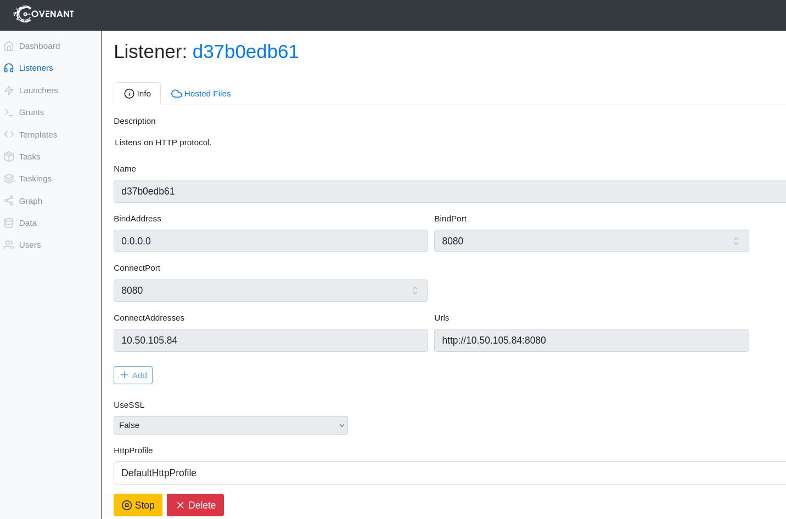
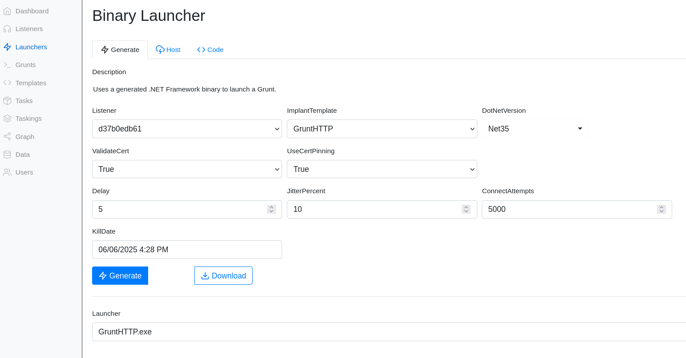

## Installation
### install dot net sdk
```
wget https://dotnet.microsoft.com/download/dotnet/scripts/v1/dotnet-install.sh
chmod +x dotnet-install.sh
./dotnet-install.sh --channel 3.1
```
### get repository
```
git clone --recurse-submodules https://github.com/cobbr/Covenant
```
### start
```
cd Covenant/Covenant
export DOTNET_SYSTEM_GLOBALIZATION_INVARIANT=1
~/.dotnet/dotnet run
```
### In Browser go to
```
127.0.0.1:7443
```
## Listener

In the context of Covenant, a Listener is a server-side component that:</br>
Listens for incoming connections from Grunts (the agents deployed on target machines).</br>
Defines how Grunts communicate back to the Covenant server.</br>
Is typically configured to use HTTP, HTTPS, or other protocols to handle beaconing and tasking traffic.</br>

In Covenant, the ConnectAddresses field in a Listener configuration specifies which addresses the Grunts (agents) should use to connect back to the C2 server.</br>
While the listener binds to a local IP/port on the attacker's machine (e.g., 0.0.0.0:443), the ConnectAddresses are the external addresses (FQDNs or IPs) that are embedded in the Grunt payload and used by compromised hosts to call home to the Covenant server</br>


## Launcher
A Launcher in Covenant is:</br>
A delivery method or script that generates the code or binary used to install the Grunt (agent) on a target.</br>
It embeds the Grunt implant and the necessary configuration (e.g., the Listener's ConnectAddresses).</br>
It typically handles payload staging, execution, and initial communication setup.</br>


###
```
```
###
```
```
###
```
```
###
```
```
###
```
```
###
```
```
###
```
```
###
```
```
###
```
```
###
```
```
###
```
```
###
```
```
###
```
```
###
```
```
###
```
```
###
```
```
###
```
```
###
```
```
###
```
```
###
```
```
###
```
```
###
```
```
###
```
```